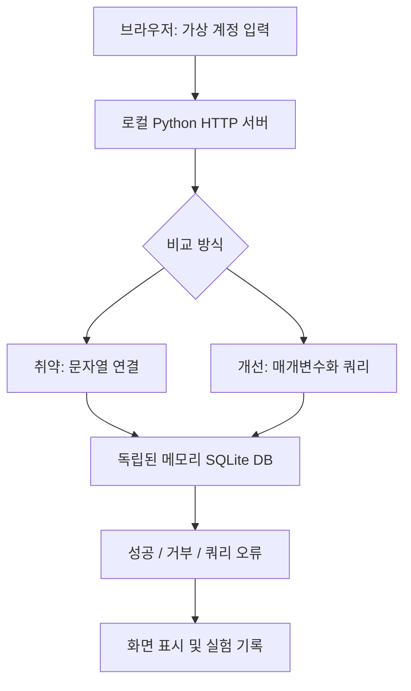

# 설계도

```mermaid
flowchart TD
 A[브라우저: 가상 계정 입력] --> B[로컬 Python HTTP 서버]
 B --> C{비교 방식}
 C --> D[취약: 문자열 연결]
 C --> E[개선: 매개변수화 쿼리]
 D --> F[독립된 메모리 SQLite DB]
 E --> F
 F --> G[성공 / 거부 / 쿼리 오류]
 G --> H[화면 표시 및 실험 기록]
```

자동 실험은 동일한 login 함수를 호출합니다. HTTP 확인은 별도 요청으로 검증합니다. 요청마다 새 메모리 DB를 만들며 데이터는 영구 저장하지 않습니다.
